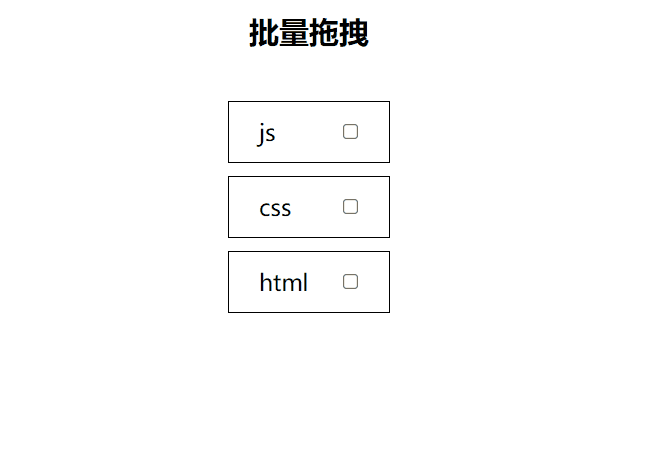
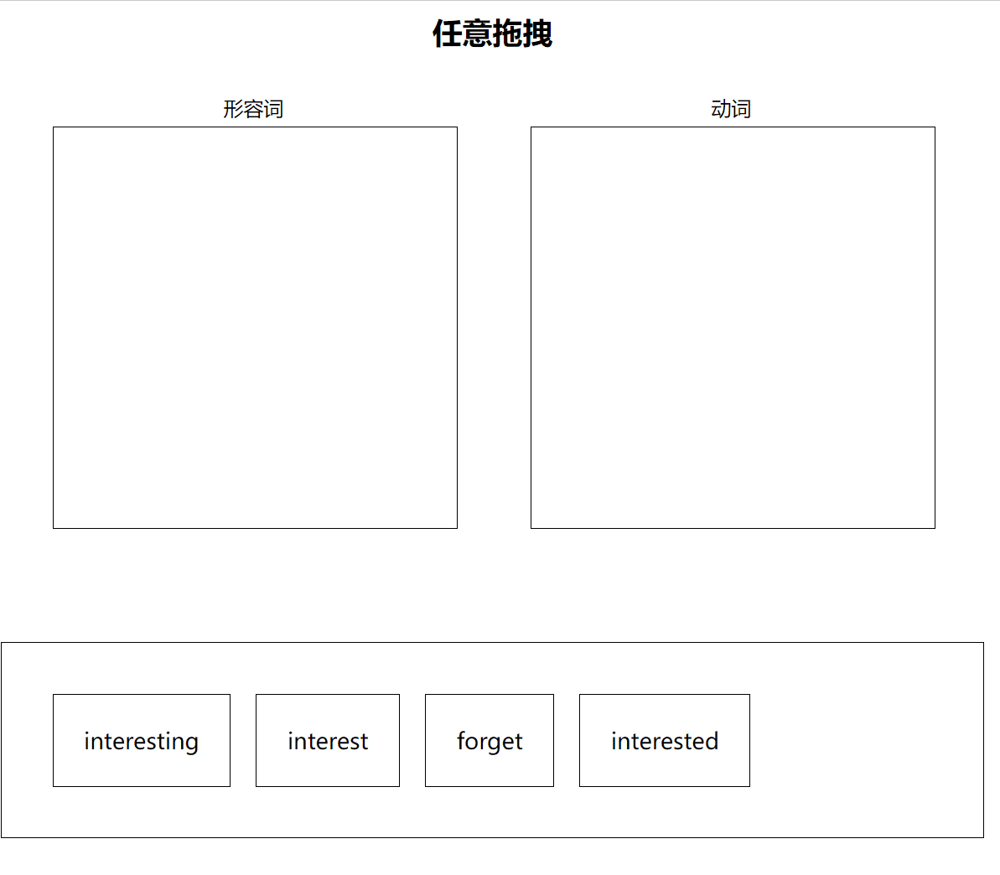
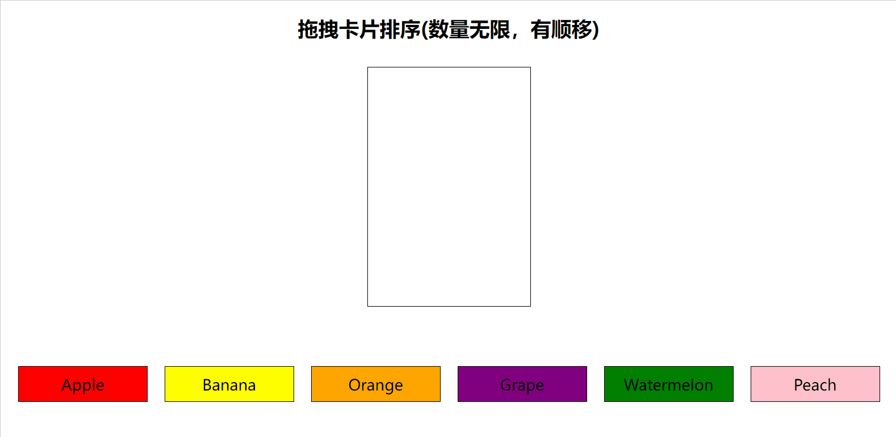

### 关于本项目

本项目使用 react-dnd 编写了一些 demo，涵盖了多种场景，尽量应用到其全面的 API

### 启动本项目

clone 下来之后

- npm install
- npm start/npm run build

### 用例

在 components 目录下，每个文件夹代表一个用例，启动项目之后，通过路由进行访问

- multiDrag: 批量拖拽，可以选择多个元素进行拖拽

- word: 任意拖拽，记录坐标进行拖拽

- cardSort: 预置卡片排序

- cardAssemble: 固定碎片的卡片拼图

- listSort: 有顺移的列表排序

- dragPreviewImg: 拖拽图片预览
- dragPreviewDom: 拖拽自定义预览
- chess: 国际象棋，官方用例